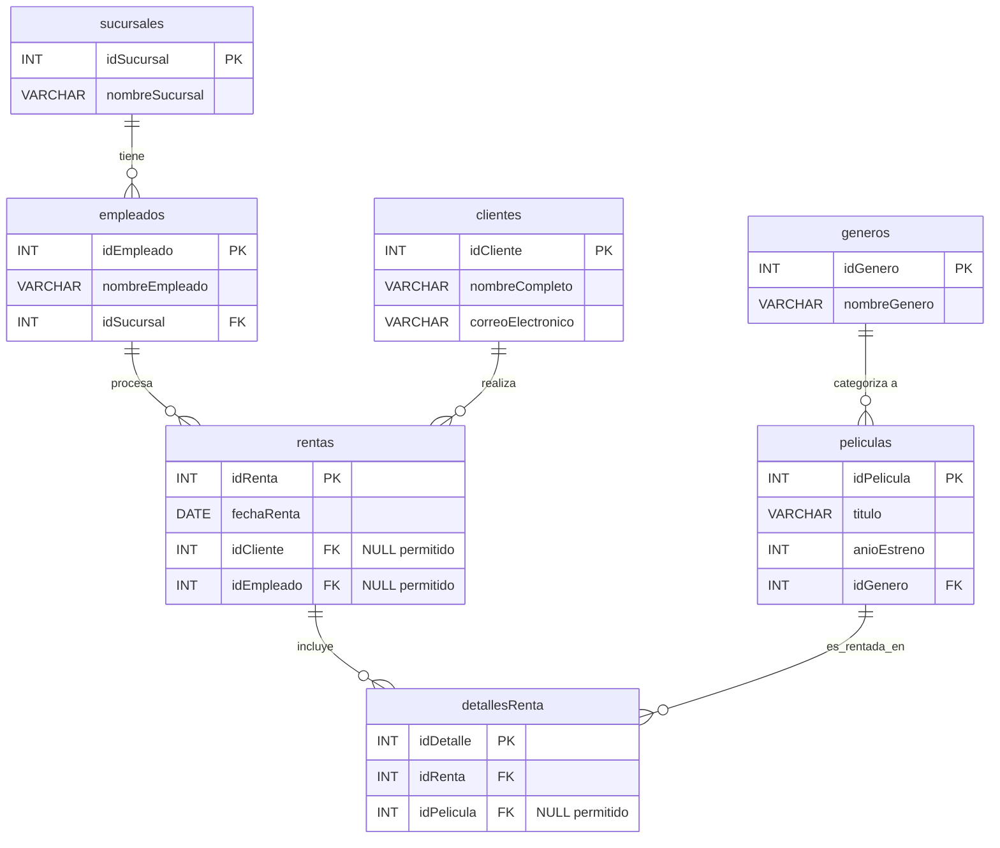

# Ejercicio Práctico SQL - JOIN: Blockbuster Reborn

**Contexto del Negocio:**
Has sido contratado como Analista de Datos para "Blockbuster Reborn", una cadena de renta de películas físicas que busca modernizarse. El negocio permite rentas a clientes registrados para acumular puntos, pero también permite rentas "express" (sin registro de cliente) y cuenta con kioskos automáticos donde no interviene ningún empleado.

Tu objetivo es diseñar la base de datos, poblarla con datos de prueba y generar reportes utilizando todos los tipos de uniones (`JOIN`).

# 🏗️ Parte 1: Modelo Entidad-Relación (DDL)
Crea la base de datos llamada blockbusterReborn y las siguientes 7 tablas. Debes utilizar exactamente los nombres indicados en lowerCamelCase para las tablas y sus columnas.

# 📝 Parte 2: Inserción de Datos (DML)

- Inserta registros de prueba en todas las tablas asegurándote de cumplir estrictamente con las siguientes condiciones para poder probar los JOINs:

- Inserta al menos 3 clientes, asegurando que un cliente nunca haya rentado.

- Inserta al menos 4 películas, asegurando que una película nunca haya sido rentada.

- Inserta al menos 3 empleados, asegurando que un empleado no haya procesado ninguna renta.

- Registra una renta "express" (donde el idCliente sea nulo).

- Registra una renta de "kiosko" (donde el idEmpleado sea nulo).

- Vincula al menos una renta con más de una película en la tabla detallesRenta.

# 🔍 Parte 3: Consultas de Negocio (DQL)
Resuelve las siguientes 4 preguntas de negocio utilizando el tipo de JOIN adecuado para cada escenario.

- Reporte 1: El ticket de compra completo.

Genera un reporte que muestre la fecha de la renta (fechaRenta), el nombre del cliente (nombreCompleto), el título de la película (titulo) y el género (nombreGenero).

Condición: Muestra únicamente las rentas perfectas; es decir, donde exista tanto un cliente registrado como una película válida en el detalle. Requiere unir 4 tablas.

- Reporte 2: Seguimiento de Clientes.

Queremos premiar a todos los clientes registrados, incluso si no han realizado rentas aún. Genera una lista que muestre el nombre del cliente (nombreCompleto) y el ID de sus rentas (idRenta).

Condición: Absolutamente todos los clientes deben aparecer en el reporte. Si no han rentado, el ID de renta debe mostrarse como Nulo.

- Reporte 3: Auditoría del Catálogo.

Necesitamos saber qué películas están generando dinero y cuáles están estancadas en los estantes. Muestra el título de todas las películas (titulo) y el ID del detalle de renta (idDetalle).

Condición: Todas las películas del catálogo deben aparecer usando un RIGHT JOIN. Las películas no rentadas mostrarán valores Nulos en el detalle.

- Reporte 4: Rendimiento total.

Queremos una conciliación total entre nuestros empleados y las rentas para ver empleados sin ventas y rentas realizadas por máquinas. Muestra el nombre del empleado (nombreEmpleado) y el ID de la renta (idRenta).

Condición: Como MySQL no soporta FULL OUTER JOIN de forma nativa, deberás emularlo utilizando la cláusula UNION.
