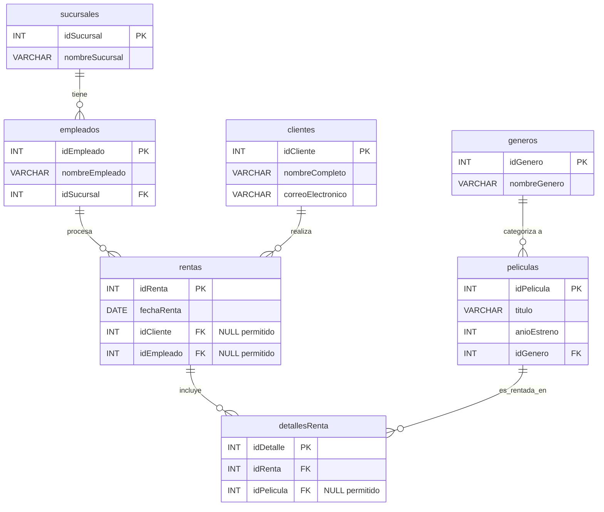

```mermaid
erDiagram
    sucursales ||--o{ empleados : "tiene"
    empleados ||--o{ rentas : "procesa"
    clientes ||--o{ rentas : "realiza"
    rentas ||--o{ detallesRenta : "incluye"
    peliculas ||--o{ detallesRenta : "es_rentada_en"
    generos ||--o{ peliculas : "categoriza a"

    sucursales {
        INT idSucursal PK
        VARCHAR nombreSucursal
    }
    
    empleados {
        INT idEmpleado PK
        VARCHAR nombreEmpleado
        INT idSucursal FK
    }
    
    clientes {
        INT idCliente PK
        VARCHAR nombreCompleto
        VARCHAR correoElectronico
    }
    
    rentas {
        INT idRenta PK
        DATE fechaRenta
        INT idCliente FK "NULL permitido"
        INT idEmpleado FK "NULL permitido"
    }
    
    detallesRenta {
        INT idDetalle PK
        INT idRenta FK
        INT idPelicula FK "NULL permitido"
    }
    
    peliculas {
        INT idPelicula PK
        VARCHAR titulo
        INT anioEstreno
        INT idGenero FK
    }
    
    generos {
        INT idGenero PK
        VARCHAR nombreGenero
    }
```
